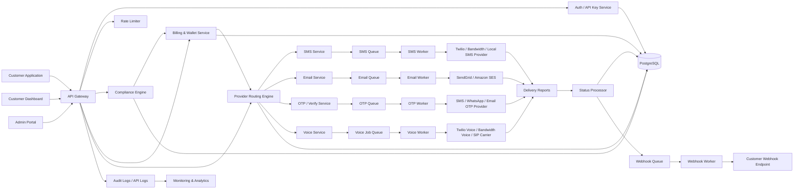
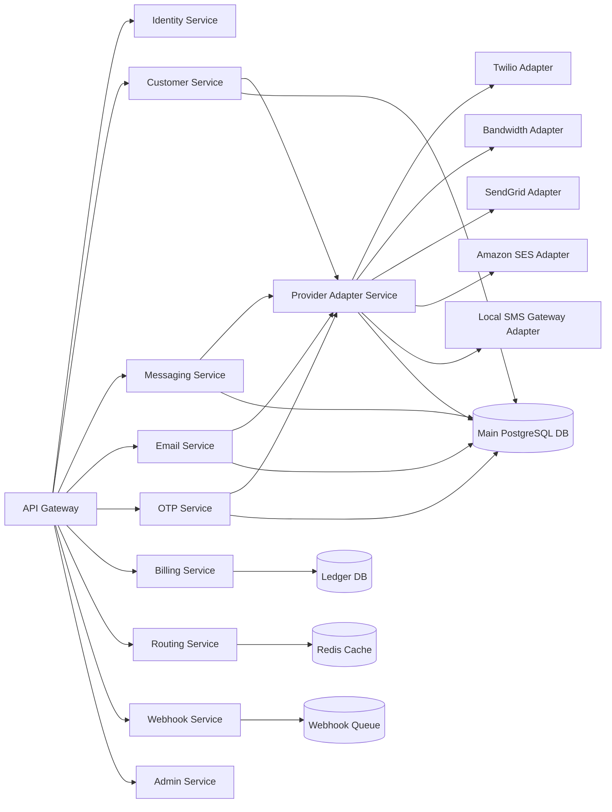
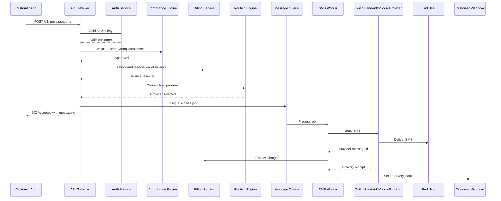
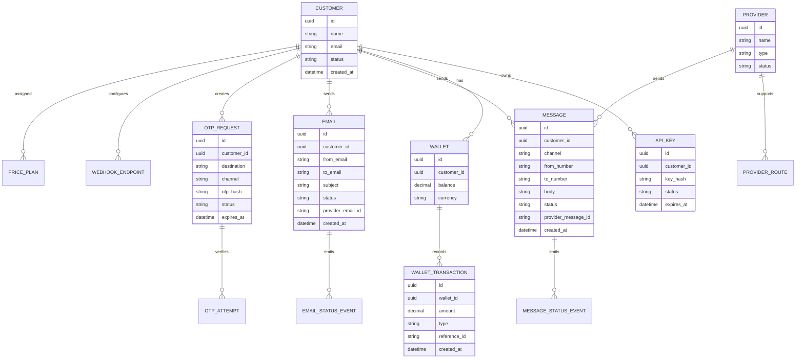

# Architecture Diagrams

## High-Level Product Architecture

```mermaid
flowchart LR
    Customer["Customer Application"] --> Api["API Gateway"]
    Dashboard["Customer Dashboard"] --> Api
    Admin["Admin Portal"] --> Api

    Api --> Auth["Auth / API Key Service"]
    Api --> Rate["Rate Limiter"]
    Api --> Compliance["Compliance Engine"]
    Api --> Billing["Billing & Wallet Service"]
    Api --> Router["Provider Routing Engine"]

    Compliance --> Billing
    Billing --> Router

    Router --> Sms["SMS Service"]
    Router --> Email["Email Service"]
    Router --> Otp["OTP / Verify Service"]
    Router --> Voice["Voice Service"]

    Sms --> SmsQueue["SMS Queue"]
    Email --> EmailQueue["Email Queue"]
    Otp --> OtpQueue["OTP Queue"]
    Voice --> VoiceQueue["Voice Job Queue"]

    SmsQueue --> SmsWorker["SMS Worker"]
    EmailQueue --> EmailWorker["Email Worker"]
    OtpQueue --> OtpWorker["OTP Worker"]
    VoiceQueue --> VoiceWorker["Voice Worker"]

    SmsWorker --> SmsProviders["Twilio / Bandwidth / Local SMS Provider"]
    EmailWorker --> EmailProviders["SendGrid / Amazon SES"]
    OtpWorker --> OtpProviders["SMS / WhatsApp / Email OTP Provider"]
    VoiceWorker --> VoiceProviders["Twilio Voice / Bandwidth Voice / SIP Carrier"]

    SmsProviders --> Delivery["Delivery Reports"]
    EmailProviders --> Delivery
    OtpProviders --> Delivery
    VoiceProviders --> Delivery

    Delivery --> Status["Status Processor"]
    Status --> Db[("PostgreSQL")]
    Status --> WebhookQueue["Webhook Queue"]
    WebhookQueue --> WebhookWorker["Webhook Worker"]
    WebhookWorker --> CustomerWebhook["Customer Webhook Endpoint"]

    Auth --> Db
    Compliance --> Db
    Billing --> Db
    Router --> Db
    Api --> Audit["Audit Logs / API Logs"]
    Audit --> Monitoring["Monitoring & Analytics"]
```

## Service Dependency Diagram

```mermaid
flowchart LR
    Api["API Gateway"] --> Identity["Identity Service"]
    Api --> Customer["Customer Service"]
    Api --> Messaging["Messaging Service"]
    Api --> Email["Email Service"]
    Api --> Otp["OTP Service"]
    Api --> Billing["Billing Service"]
    Api --> Routing["Routing Service"]
    Api --> Webhook["Webhook Service"]
    Api --> Admin["Admin Service"]

    Messaging --> Adapter["Provider Adapter Service"]
    Email --> Adapter
    Otp --> Adapter
    Customer --> Adapter

    Adapter --> Twilio["Twilio Adapter"]
    Adapter --> Bandwidth["Bandwidth Adapter"]
    Adapter --> SendGrid["SendGrid Adapter"]
    Adapter --> Ses["Amazon SES Adapter"]
    Adapter --> LocalSms["Local SMS Gateway Adapter"]

    Customer --> MainDb[("Main PostgreSQL DB")]
    Messaging --> MainDb
    Email --> MainDb
    Otp --> MainDb
    Adapter --> MainDb

    Billing --> Ledger[("Ledger DB")]
    Routing --> Redis[("Redis Cache")]
    Webhook --> WebhookQueue[("Webhook Queue")]
```

## SMS Sending Sequence

```mermaid
sequenceDiagram
    participant Customer as Customer App
    participant Api as API Gateway
    participant Auth as Auth Service
    participant Compliance as Compliance Engine
    participant Billing as Billing Service
    participant Routing as Routing Engine
    participant Queue as Message Queue
    participant Worker as SMS Worker
    participant Provider as Twilio/Bandwidth/Local Provider
    participant User as End User
    participant Webhook as Customer Webhook

    Customer->>Api: POST /v1/messages/sms
    Api->>Auth: Validate API key
    Auth-->>Api: Valid customer
    Api->>Compliance: Validate sender/template/consent
    Compliance-->>Api: Approved
    Api->>Billing: Check and reserve wallet balance
    Billing-->>Api: Balance reserved
    Api->>Routing: Choose best provider
    Routing-->>Api: Provider selected
    Api->>Queue: Enqueue SMS job
    Api-->>Customer: 202 Accepted with messageId
    Queue->>Worker: Process job
    Worker->>Provider: Send SMS
    Provider->>User: Deliver SMS
    Provider-->>Worker: Provider messageId
    Worker->>Billing: Finalize charge
    Provider-->>Worker: Delivery receipt
    Worker->>Webhook: Send delivery status
```

## Data Model Overview

```mermaid
erDiagram
    CUSTOMER ||--o{ API_KEY : owns
    CUSTOMER ||--o{ WALLET : has
    CUSTOMER ||--o{ MESSAGE : sends
    CUSTOMER ||--o{ EMAIL : sends
    CUSTOMER ||--o{ OTP_REQUEST : creates
    CUSTOMER ||--o{ WEBHOOK_ENDPOINT : configures
    CUSTOMER ||--o{ PRICE_PLAN : assigned

    WALLET ||--o{ WALLET_TRANSACTION : records
    MESSAGE ||--o{ MESSAGE_STATUS_EVENT : emits
    EMAIL ||--o{ EMAIL_STATUS_EVENT : emits
    OTP_REQUEST ||--o{ OTP_ATTEMPT : verifies

    PROVIDER ||--o{ PROVIDER_ROUTE : supports
    PROVIDER ||--o{ MESSAGE : sends

    CUSTOMER {
        uuid id
        string name
        string email
        string status
        datetime created_at
    }

    API_KEY {
        uuid id
        uuid customer_id
        string key_hash
        string status
        datetime expires_at
    }

    MESSAGE {
        uuid id
        uuid customer_id
        string channel
        string from_number
        string to_number
        string body
        string status
        string provider_message_id
        datetime created_at
    }

    EMAIL {
        uuid id
        uuid customer_id
        string from_email
        string to_email
        string subject
        string status
        string provider_email_id
        datetime created_at
    }

    WALLET {
        uuid id
        uuid customer_id
        decimal balance
        string currency
    }

    WALLET_TRANSACTION {
        uuid id
        uuid wallet_id
        decimal amount
        string type
        string reference_id
        datetime created_at
    }

    OTP_REQUEST {
        uuid id
        uuid customer_id
        string destination
        string channel
        string otp_hash
        string status
        datetime expires_at
    }

    PROVIDER {
        uuid id
        string name
        string type
        string status
    }
```
