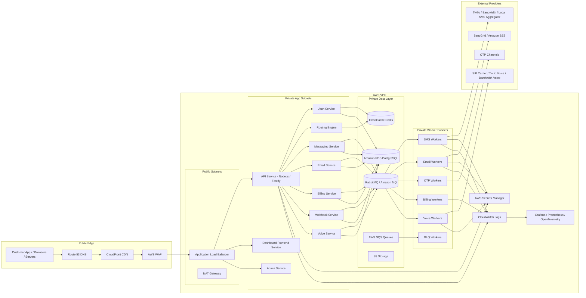

# Production Infrastructure Diagram

This production design assumes AWS and a practical MVP stack. Start with ECS Fargate instead of Kubernetes unless the platform already has a team ready to operate Kubernetes.

## MVP AWS Components

| Component | Recommendation |
| --- | --- |
| Compute | ECS Fargate |
| API ingress | Application Load Balancer |
| Database | Amazon RDS PostgreSQL |
| Cache/rate limits | ElastiCache Redis |
| Queue | RabbitMQ/Amazon MQ or AWS SQS |
| Object storage | S3 |
| Secrets | AWS Secrets Manager |
| Logs | CloudWatch Logs |
| Metrics/traces | OpenTelemetry + Prometheus/Grafana |
| Edge security | AWS WAF + CloudFront |

## Deployment Notes

1. Keep API and worker services private except for the ALB-facing API and dashboard.
2. Store provider credentials only in Secrets Manager.
3. Use queue-based processing for SMS, email, OTP, voice, billing, and webhooks.
4. Add idempotency keys to customer-facing send APIs.
5. Use immutable wallet ledger transactions instead of directly mutating balance without audit.
6. Track provider latency, error rate, delivery rate, and cost per route.
