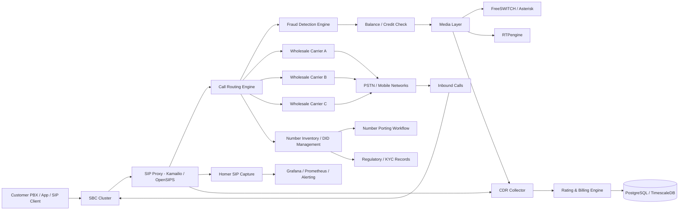

# Wholesale Telecom Infrastructure

This is the later-stage telecom architecture. It is not the MVP. Build the CPaaS aggregator first, then add SIP/voice wholesale once the business, compliance, fraud controls, and support model are ready.

## Core Components

| Component | Purpose |
| --- | --- |
| SBC | Security boundary for SIP traffic |
| SIP proxy | Routes calls between customers and carriers |
| Media server | IVR, recording, conferencing, transcoding |
| RTP engine | Handles voice media packets |
| CDR collector | Stores call detail records for billing |
| Rating engine | Calculates cost by route, destination, prefix, and duration |
| Fraud engine | Detects high-cost abuse, Wangiri, call pumping, route anomalies |
| Number management | DID inventory, assignment, porting, release |
| Monitoring/NOC | Uptime, latency, packet loss, route failures |

## Common Open-Source Building Blocks

| Need | Tools |
| --- | --- |
| SIP proxy | Kamailio, OpenSIPS |
| Media server | FreeSWITCH, Asterisk |
| RTP handling | RTPengine, RTPEProxy |
| SIP tracing | Homer SIPCapture |
| Config/CDR/billing DB | PostgreSQL, TimescaleDB |
| Routing cache | Redis |
| Monitoring | Prometheus, Grafana |

## Reality Check

Software is only one part of wholesale telecom. The hard parts are carrier contracts, telecom licensing, emergency calling, lawful compliance, KYC, spam/fraud controls, billing settlement, route quality monitoring, and 24/7 support.
